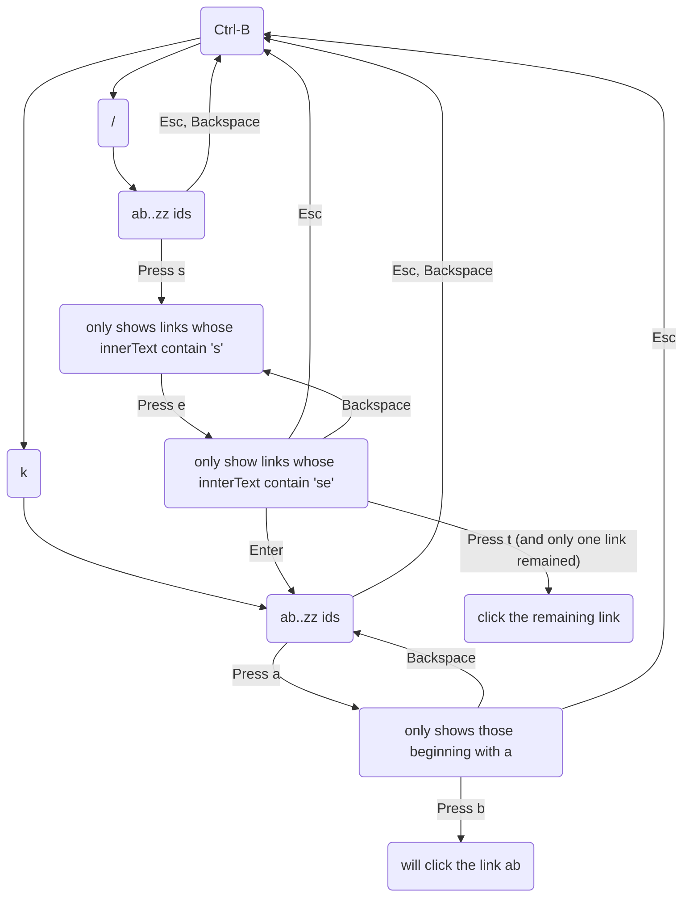

# jump-to (WIP)
A Vimium inspired keyboard shortcut script for browsers. Highlights all clickable elements on a page, then provides shortcuts to click them so you never have to leave your keyboard again!

## Usage

### Chrome

- Download the repo
- Run `npm install && npm run build-package`
- Open the dist/ folder in the repo folder as an extension

### Shorcuts

- Ctrl-b: enable / disable the extension.
- k: click on links by typing their randomly generated two letter ids. Type the first letter to narrow it down.
- /: click on links by searching for the contents of their innerText. Type the string to narrow it down, automatically clicking once one link-jump is left.
- Backspace when there's current input: go back one step.
- Backspace when no current input / Esc: exit link jump mode, return to normal.
- Enter when in search mode: switch to regular mode.

This is somewhat represented by this graph:

## TODO

- Add new link jumps as the user scrolls down the page
- Detect darkness of site and pick a better border color for links
- Add test suite
- Add the ability to ctrl-click as a shortcut
- Place labelled elements so they don't collide
- Distribute labels closer to the home keys vs random letters (maybe?)
- Add case sensitive search for text
- Add regex search for text

## Current example

